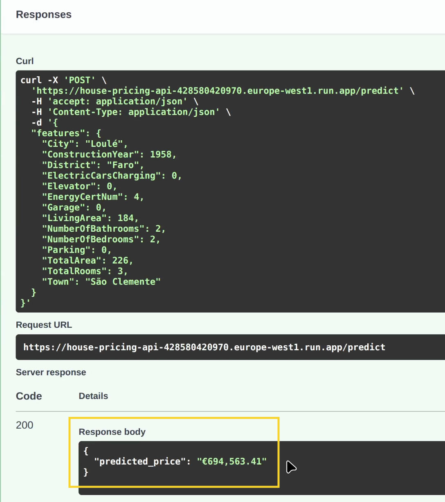

# 🏡 House Pricing Predictive Modelling

## Overview
This repository focuses on **building and deploying a predictive machine learning model on Portugal house pricing data**. The [Real Estate Listings in Portugal dataset](https://www.kaggle.com/datasets/luvathoms/portugal-real-estate-2024) 
covers 2018 to 2024 data collected from several Portugese real estate websites. 

## Objectives:
1. Model Training and Evaluation: Train a regression model on the Portugal Housing prices
    * Evaluate different regression tree and boosted models
    * Practice ensemble modelling on the data
    * Determine best type of model
2. Feature Importance: List which features are the most important to pricing
3. Full ML Pipeline to Deployment: Deploy the model using Docker and GCP

## Key Findings:
<div align="center">
  
</div>

* Cleaned and consolidated varying, disorganized, multi-source data into one unified, ML-ready dataset.
* From the baseline, **boosted models gave up to ~€128k euro deduction in MAE** / Mean Absolute Error for a vast improvement in predictive performance.
* **Light Gradient Boosting** was chosen for deployment. It effectively gave the best performance overall and is practical to deploy as a strong singular model. 
* ***Stacked generalization did not show marginal improvements***: Light Gradient Boosting outperformed it and XGB also competed closely with the meta learner. 
* The 5 most important features for pricing are:
    1. NumberOfBathrooms - Essentially our proxy variable for overall number of rooms, property size and functionality - all these details it can suggest makes it the strongest driver for price levels in our deployed LGB model
    2. Town - the smallest most specific geographical scale is the 2nd important driver for price predictions.
    3. City - geographical variables take hold of 2 feature importance spots. Overall location of a house in Portugal is extremely important for pricing predictions. 
    4. LivingArea - measurable indoor livable space is 4th important.
    5. EnergyCertNum - the energy certificate of a house and its efficiency according to Portugal standards lend strong prediction for price points

## 📦 Libraries used:
* pandas
* numpy
* matplotlib
* seaborn
* scikitlearn
* statsmodels
1. Full list of libraries needed for the whole notebook demo are in `full-requirements.txt`
2. Base libraries needed for model recreation are in `requirements.txt`

### 🔎 Viewing / Installation:
* *Viewing Option:* For complete analysis and demonstration, simply view the notebook file `RealEstateAnalysis.ipynb`.
* *Model Recreation Option:* Run `train.py` found inside the "api" folder to rebuild and refit the Light Gradient Boosting model used in this research.
* *Full Installation Option:* To develop on all the code firsthand, clone this repo\
    ```git clone https://github.com/giddygarcia/house-pricing-estimator.git```

## ✉️ Author and Contact Information
Developed by: Christine Garcia 

Have questions? Feel free to:
* email me at cavgarcia22@gmail.com 
* connect on [LinkedIn](www.linkedin.com/in/cavgarcia) 
* or [view more projects](https://github.com/giddygarcia) that I enjoyed making